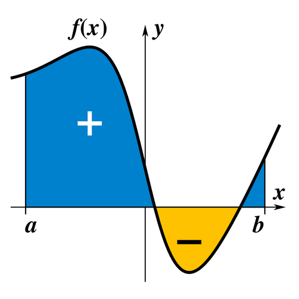
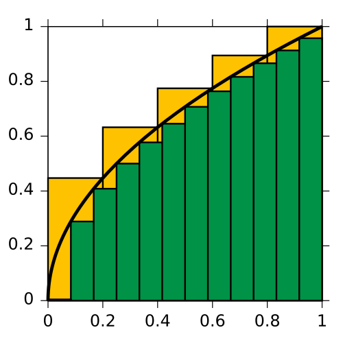

# ¿Qué es una integral?
Una integral es una generalización de la suma de infinitos sumandos, infinitesimalmente pequeños: una suma continua. La integral es la operación inversa al diferencial de una función.

::: {style="text-align:center; width:50%; margin-left: auto; margin-right: auto;"}

:::

## 

::: {style="text-align:center; width:50%; margin-left: auto; margin-right: auto;"}

:::

## Aplicaciones de las integrales
Las integrales tienen diversas aplicaciones en el área científica, principalmente en la Física para:

- Calcular ecuaciones de itinerario (Aceleración, velocidad y posición)
- Calcular centros de masa y momentos de inercia
- Calcular campos magnéticos (Ley de Gauss)
- Calcular la entropía de un proceso (Termodinámica)

## Sustitución
La integración por sustitución es la "regla de la cadena" al revés. Si vemos un producto donde aparece una función interior y su derivada (salvo por una constante), podemos cambiar de variable.

Para empezar, busquemos la función interior $u$ y escribamos su derivada $du$. Si sobra una constante, la compensamos.

## Ejercicio 1
Calcular la siguiente integral:
$$\int 6x (x^2 + 2)^4 \, dx$$

##
Primero reconocemos la función interior, que en este caso es $u = x^2 + 2$. Su derivada es $du = 2x \, dx$.

Tenemos $6x \, dx$ en la integral, pero nuestra derivada nos da $2x \, dx$, por lo que sobra una constante que podemos compensar:
$$6x \, dx = 3 \cdot 2x \, dx = 3 \, du$$

##
Reemplazando en la integral, tenemos que:
$$\int 6x (x^2 + 2)^4 \, dx = 3 \int u^4 \, du$$

Integrando (ya que es una potencia):
$$3 \int u^4 \, du = 3 \cdot \frac{u^5}{5} + C$$

Ahora reemplazamos $u = x^2 + 2$ para volver a la variable original:
$$\frac{3}{5} (x^2 + 2)^5 + C$$

##
Podemos verificar que el resultado es correcto derivando:
$$\frac{d}{dx} \left[ \frac{3}{5} (x^2 + 2)^5 \right] = \frac{3}{5} \cdot 5 (x^2 + 2)^4 \cdot 2x = 6x (x^2 + 2)^4$$

Efectivamente recuperamos el integrando original.

## Ejercicio 2
Calcular la siguiente integral:
$$\int \frac{3x^2}{x^3 - 1} \, dx$$

##
Aquí la función interior es $u = x^3 - 1$, y su derivada es $du = 3x^2 \, dx$.

En este caso la derivada aparece exactamente en el numerador, por lo que no necesitamos compensar nada:
$$\int \frac{3x^2}{x^3 - 1} \, dx = \int \frac{du}{u}$$

##
Este es el patrón logarítmico, cuya integral ya conocemos:
$$\int \frac{du}{u} = \ln |u| + C$$

Reemplazando $u = x^3 - 1$:
$$\ln |x^3 - 1| + C$$

## Ejercicio 3
Calcular la siguiente integral:
$$\int \frac{e^{2x}}{1 + e^{2x}} \, dx$$

##
Vemos que la derivada del denominador $1 + e^{2x}$ es $2e^{2x}$, que aparece en el numerador salvo por el 2. Tomamos $u = 1 + e^{2x}$ y $du = 2e^{2x} \, dx$.

Compensando la constante:
$$e^{2x} \, dx = \frac{1}{2} \, du$$

##
Reemplazando en la integral:
$$\int \frac{e^{2x}}{1 + e^{2x}} \, dx = \frac{1}{2} \int \frac{du}{u} = \frac{1}{2} \ln |u| + C$$

Volviendo a la variable original:
$$\frac{1}{2} \ln |1 + e^{2x}| + C$$

## Ejercicio 4
Calcular la siguiente integral:
$$\int \frac{x^3}{x^2 + 1} \, dx$$

##
En este ejercicio la sustitución no aparece de inmediato, pero podemos reescribir el numerador. Notemos que $x^3 = x \cdot x^2$, y como $x^2 = (x^2 + 1) - 1$, podemos escribir:
$$x^3 \, dx = x (x^2 + 1 - 1) \, dx$$

Ahora sí, tomamos $u = x^2 + 1$ y $du = 2x \, dx$, por lo que $x \, dx = \frac{1}{2} du$.

##
Reemplazando en la integral, tenemos que:
$$\int \frac{x^3}{x^2 + 1} \, dx = \frac{1}{2} \int \frac{u - 1}{u} \, du$$

Separando la fracción:
$$\frac{1}{2} \int \left( 1 - \frac{1}{u} \right) du$$

##
Integrando término a término:
$$\frac{1}{2} (u - \ln |u|) + C$$

Reemplazando $u = x^2 + 1$:
$$\frac{x^2 + 1}{2} - \frac{1}{2} \ln (x^2 + 1) + C$$

Que también podemos escribir como:
$$\frac{x^2}{2} - \frac{1}{2} \ln (x^2 + 1) + C$$

ya que la constante $\frac{1}{2}$ se puede absorber en $C$.

## Ejercicio 5
Calcular la siguiente integral:
$$\int \frac{1}{x(1 + \ln x)} \, dx$$

##
Aquí la función interior está anidada, notemos que $u = 1 + \ln x$ y su derivada es $du = \frac{1}{x} \, dx$.

En este caso la derivada aparece exactamente en el integrando (el $\frac{1}{x}$ que multiplica), por lo que:
$$\int \frac{1}{x(1 + \ln x)} \, dx = \int \frac{du}{u}$$

##
Nuevamente tenemos el patrón logarítmico:
$$\int \frac{du}{u} = \ln |u| + C$$

Reemplazando $u = 1 + \ln x$:
$$\ln |1 + \ln x| + C$$

## Ejercicio 6
Calcular la siguiente integral:
$$\int \frac{2x}{(x^2 + 4)^3} \, dx$$

##
Tomamos $u = x^2 + 4$ y $du = 2x \, dx$. La derivada aparece exacta en el numerador, por lo que podemos escribir la integral como una potencia:
$$\int \frac{2x}{(x^2 + 4)^3} \, dx = \int u^{-3} \, du$$

##
Integrando la potencia:
$$\int u^{-3} \, du = \frac{u^{-2}}{-2} + C = -\frac{1}{2u^2} + C$$

Reemplazando $u = x^2 + 4$:
$$-\frac{1}{2(x^2 + 4)^2} + C$$

## Ejercicio 7
Calcular la siguiente integral:
$$\int \frac{\arctan x}{1 + x^2} \, dx$$

##
Sabemos que la derivada de $\arctan x$ es $\frac{1}{1 + x^2}$, por lo que tomamos $u = \arctan x$ y $du = \frac{1}{1 + x^2} \, dx$.

La derivada aparece exactamente en el integrando, por lo que:
$$\int \frac{\arctan x}{1 + x^2} \, dx = \int u \, du$$

##
Integrando:
$$\int u \, du = \frac{u^2}{2} + C$$

Reemplazando $u = \arctan x$:
$$\frac{1}{2} (\arctan x)^2 + C$$

## Ejercicio 8
Calcular la siguiente integral:
$$\int \frac{\ln x}{x} \, dx$$

##
Tomamos $u = \ln x$ y $du = \frac{1}{x} \, dx$. La derivada aparece exacta en el integrando:
$$\int \frac{\ln x}{x} \, dx = \int u \, du$$

Integrando:
$$\int u \, du = \frac{u^2}{2} + C$$

##
Reemplazando $u = \ln x$:
$$\frac{1}{2} (\ln x)^2 + C$$

## Ejercicio 9
Calcular la siguiente integral:
$$\int \frac{1}{\sqrt{x} (1 + \sqrt{x})} \, dx$$

##
Aquí conviene tomar $u = 1 + \sqrt{x}$, cuya derivada es $du = \frac{1}{2\sqrt{x}} \, dx$.

Compensando la constante:
$$\frac{1}{\sqrt{x}} \, dx = 2 \, du$$

##
Reemplazando en la integral:
$$\int \frac{1}{\sqrt{x} (1 + \sqrt{x})} \, dx = 2 \int \frac{du}{u}$$

Integrando y volviendo a la variable original:
$$2 \ln |u| + C = 2 \ln |1 + \sqrt{x}| + C$$

## Ejercicio 10
Calcular la siguiente integral:
$$\int \tan x \, dx$$

##
Recordemos que $\tan x = \frac{\sin x}{\cos x}$, por lo que podemos escribir la integral como:
$$\int \tan x \, dx = \int \frac{\sin x}{\cos x} \, dx$$

Tomamos $u = \cos x$ y $du = -\sin x \, dx$, por lo que $\sin x \, dx = -du$.

##
Reemplazando:
$$\int \frac{\sin x}{\cos x} \, dx = -\int \frac{du}{u}$$

Integrando y volviendo a la variable original:
$$-\ln |u| + C = -\ln |\cos x| + C$$

# Gracias por su atención
