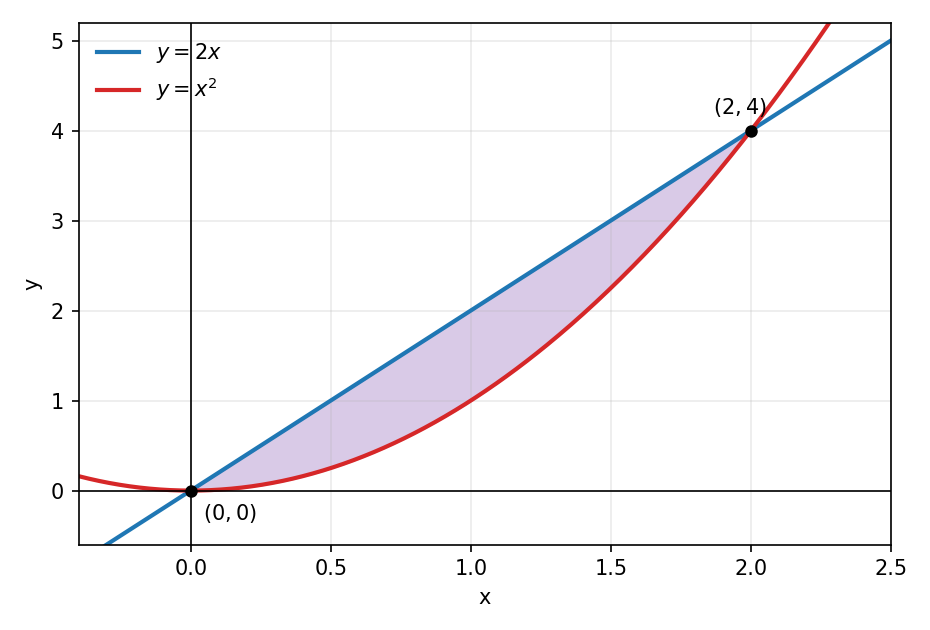
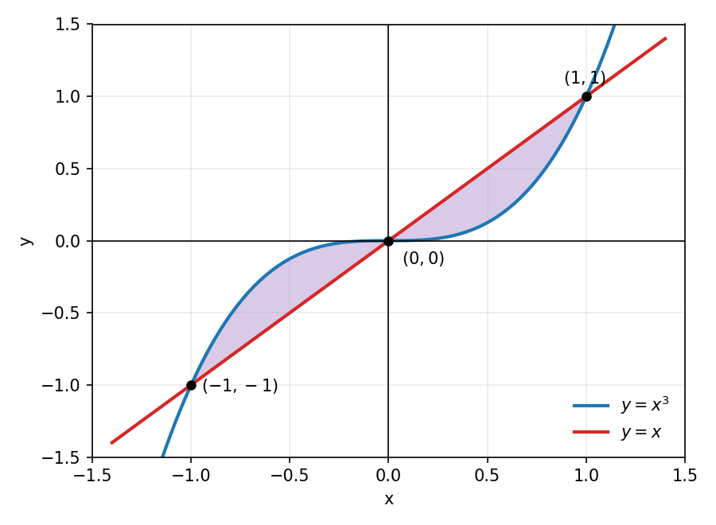
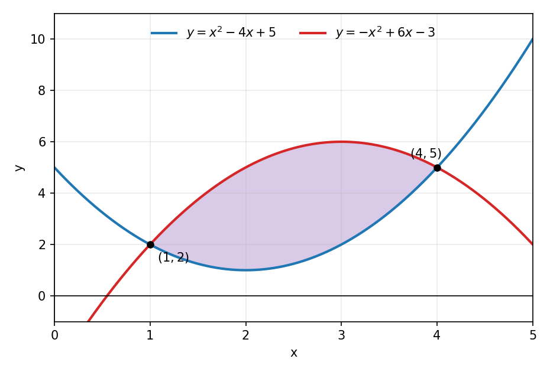
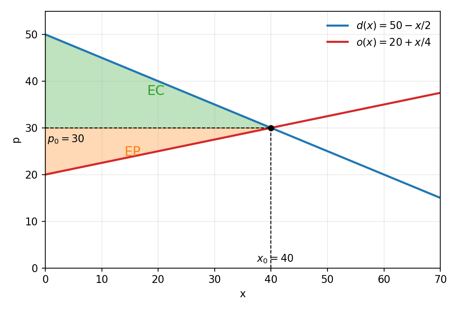

## La integral definida y el área
Recordemos que la integral definida se calcula con el Teorema Fundamental del Cálculo:

$$\int_a^b f(x) \, dx = F(b) - F(a)$$

donde $F$ es una primitiva de $f$. Si $f(x) \geq 0$ en el intervalo $[a, b]$, la integral es exactamente el área de la región bajo la gráfica de $f$ y sobre el eje $x$. Si $f$ toma valores negativos, la integral cuenta esa parte como área negativa, con signo.

## Área entre dos curvas
Si $f$ y $g$ son continuas en $[a, b]$ y se cumple $f(x) \geq g(x)$ para todo $x$ en el intervalo, entonces el área de la región encerrada entre las dos curvas es:

$$A = \int_a^b \left[ f(x) - g(x) \right] dx$$

El procedimiento tiene tres pasos. Primero se encuentran los puntos de intersección igualando $f(x) = g(x)$, que entregan los límites $a$ y $b$. Luego se determina cuál de las dos curvas está por encima en el intervalo. Finalmente se integra la diferencia entre la curva superior y la inferior. Si las curvas se cruzan dentro del intervalo, el área se calcula separando la integral en cada tramo.

## La región entre las curvas

::: {style="text-align:center;"}
{width=68%}
:::

En la figura, la curva superior es $y = 2x$ y la inferior es $y = x^2$ en el intervalo $[0, 2]$. El área sombreada es la integral de la diferencia entre ambas.

## Ejercicio 1
Calcular el área de la región encerrada entre las curvas:

$$y = 2x, \qquad y = x^2$$

##

Buscamos las intersecciones igualando las expresiones:

$$2x = x^2 \quad \Longrightarrow \quad x^2 - 2x = 0 \quad \Longrightarrow \quad x(x - 2) = 0$$

de modo que $x = 0$ y $x = 2$. Estos son los límites de integración.

En el intervalo $(0, 2)$ se cumple $2x > x^2$.

$$2x - x^2 = x(2 - x) > 0$$

Por lo tanto la curva superior es $y = 2x$ y la inferior es $y = x^2$.

##

El área es la integral de la diferencia entre la curva superior y la inferior:

$$A = \int_0^2 \left( 2x - x^2 \right) dx$$

Calculamos la primitiva y evaluamos en los extremos:

$$A = \left[ x^2 - \frac{x^3}{3} \right]_0^2 = \left( 4 - \frac{8}{3} \right) - 0 = \frac{12}{3} - \frac{8}{3} = \frac{4}{3}$$

El área de la región es $\frac{4}{3}$ unidades cuadradas.

## Ejercicio 2
Calcular el área de la región encerrada entre las curvas:

$$y = x^3, \qquad y = x$$

##

Igualamos las expresiones para encontrar las intersecciones:

$$x^3 = x \quad \Longrightarrow \quad x^3 - x = 0 \quad \Longrightarrow \quad x(x^2 - 1) = 0$$

de modo que las curvas se cortan en $x = -1$, $x = 0$ y $x = 1$.

La región tiene dos tramos: en $(-1, 0)$ la curva $y = x^3$ está por encima, y en $(0, 1)$ la curva $y = x$ está por encima.

## La región entre las curvas

::: {style="text-align:center;"}
{width=60%}
:::

La figura muestra los dos tramos de la región: a la izquierda de $x = 0$ la curva $y = x^3$ queda por encima, y a la derecha la curva $y = x$ queda por encima.

##

La función $|x - x^3|$ es par, porque al cambiar $x$ por $-x$ se obtiene el mismo valor. Por lo tanto el área del tramo izquierdo es igual a la del tramo derecho y podemos duplicar la integral sobre $[0, 1]$, donde $x \geq x^3$:

$$A = 2 \int_0^1 \left( x - x^3 \right) dx$$

##

Integramos término a término y evaluamos:

$$A = 2 \left[ \frac{x^2}{2} - \frac{x^4}{4} \right]_0^1 = 2 \left( \frac{1}{2} - \frac{1}{4} \right) = 2 \cdot \frac{1}{4} = \frac{1}{2}$$

El área encerrada entre las curvas es $\frac{1}{2}$ unidades cuadradas.

## Ejercicio 3
Considere la región $R$ encerrada entre las parábolas:

$$y = x^2 - 4x + 5, \qquad y = -x^2 + 6x - 3$$

a) Determine los puntos de intersección de las parábolas.

b) Calcule el área de la región $R$.

##

Igualamos las expresiones para encontrar las intersecciones:

$$x^2 - 4x + 5 = -x^2 + 6x - 3 \quad \Longrightarrow \quad 2x^2 - 10x + 8 = 0 \quad \Longrightarrow \quad x^2 - 5x + 4 = 0$$

Factorizamos el trinomio:

$$(x - 1)(x - 4) = 0 \quad \Longrightarrow \quad x = 1, \quad x = 4$$

Evaluando en cualquiera de las parábolas se obtienen los puntos de intersección $(1, 2)$ y $(4, 5)$. Estos son los límites de integración.

##

En el intervalo $(1, 4)$ debemos identificar la curva superior. Evaluamos ambas parábolas en $x = 2$:

$$y_1(2) = 2^2 - 4(2) + 5 = 1, \qquad y_2(2) = -2^2 + 6(2) - 3 = 5$$

Como $y_2(2) > y_1(2)$, la curva superior es $y = -x^2 + 6x - 3$, la parábola que abre hacia abajo.

## La región $R$

::: {style="text-align:center;"}
{width=64%}
:::

##

El área se calcula integrando la diferencia entre la curva superior y la inferior:

$$A = \int_1^4 \left[ \left( -x^2 + 6x - 3 \right) - \left( x^2 - 4x + 5 \right) \right] dx = \int_1^4 \left( -2x^2 + 10x - 8 \right) dx$$

Integramos y evaluamos en los extremos. En $x = 4$ la primitiva vale $\frac{16}{3}$ y en $x = 1$ vale $-\frac{11}{3}$:

$$A = \left[ -\frac{2x^3}{3} + 5x^2 - 8x \right]_1^4 = \frac{16}{3} - \left( -\frac{11}{3} \right) = \frac{27}{3} = 9$$

El área de la región $R$ es $9$ unidades cuadradas.

## Excedente del consumidor y del productor
En un mercado, la función de demanda $d(x)$ indica el precio que los consumidores están dispuestos a pagar por la cantidad $x$ de unidades. La función de oferta $o(x)$ indica el precio que los productores están dispuestos a aceptar por esa cantidad.

El mercado alcanza el equilibrio en el punto $(x_0, p_0)$, donde la cantidad ofrecida iguala a la demandada:

$$d(x_0) = o(x_0), \qquad p_0 = d(x_0)$$

##

El excedente del consumidor mide el ahorro total de los consumidores que pagaban más que el precio de equilibrio. Es el área entre la curva de demanda y la recta horizontal $p = p_0$, desde $x = 0$ hasta $x_0$:

$$EC = \int_0^{x_0} \left[ d(x) - p_0 \right] dx$$

El excedente del productor mide la ganancia total de los productores que vendían a un precio menor que el de equilibrio. Es el área entre la recta horizontal $p = p_0$ y la curva de oferta, desde $x = 0$ hasta $x_0$:

$$EP = \int_0^{x_0} \left[ p_0 - o(x) \right] dx$$

## Los excedentes en el gráfico

::: {style="text-align:center;"}
{width=68%}
:::

El excedente del consumidor (verde) es el área bajo la demanda y sobre el precio de equilibrio. El excedente del productor (naranjo) es el área sobre la oferta y bajo el precio de equilibrio.

## Ejercicio 4
En un mercado, la función de demanda y la función de oferta son:

$$d(x) = 50 - \frac{x}{2}, \qquad o(x) = 20 + \frac{x}{4}$$

donde $x$ es la cantidad de unidades y los precios están en miles de pesos.

a) Determine la cantidad y el precio de equilibrio del mercado.

b) Calcule el excedente del consumidor.

c) Calcule el excedente del productor.

##

Igualamos demanda y oferta para encontrar la cantidad de equilibrio:

$$50 - \frac{x_0}{2} = 20 + \frac{x_0}{4} \quad \Longrightarrow \quad 30 = \frac{3x_0}{4} \quad \Longrightarrow \quad x_0 = 40$$

El precio de equilibrio se obtiene evaluando la demanda en $x_0 = 40$:

$$p_0 = d(40) = 50 - \frac{40}{2} = 30$$

El punto de equilibrio es $(x_0, p_0) = (40, 30)$.

##

El excedente del consumidor es:

$$EC = \int_0^{40} \left[ \left( 50 - \frac{x}{2} \right) - 30 \right] dx = \int_0^{40} \left( 20 - \frac{x}{2} \right) dx$$

Integramos y evaluamos:

$$EC = \left[ 20x - \frac{x^2}{4} \right]_0^{40} = \left( 800 - 400 \right) - 0 = 400$$

Los consumidores ahorran $400$ mil pesos.

##

El excedente del productor es:

$$EP = \int_0^{40} \left[ 30 - \left( 20 + \frac{x}{4} \right) \right] dx = \int_0^{40} \left( 10 - \frac{x}{4} \right) dx$$

Integramos y evaluamos:

$$EP = \left[ 10x - \frac{x^2}{8} \right]_0^{40} = \left( 400 - 200 \right) - 0 = 200$$

Los productores ganan $200$ mil pesos.

## Ejercicio 5
Las funciones de demanda y oferta de un producto son:

$$d(x) = 144 - x^2, \qquad o(x) = 48 + 4x$$

a) Determine la cantidad y el precio de equilibrio del mercado.

b) Calcule el excedente del consumidor.

c) Calcule el excedente del productor.

##

Igualamos demanda y oferta:

$$144 - x^2 = 48 + 4x \quad \Longrightarrow \quad x^2 + 4x - 96 = 0$$

Factorizamos el trinomio:

$$(x + 12)(x - 8) = 0$$

Las soluciones son $x = -12$ y $x = 8$. Como la cantidad no puede ser negativa, la cantidad de equilibrio es $x_0 = 8$. El precio de equilibrio es:

$$p_0 = d(8) = 144 - 64 = 80$$

##

El excedente del consumidor es:

$$EC = \int_0^8 \left[ \left( 144 - x^2 \right) - 80 \right] dx = \int_0^8 \left( 64 - x^2 \right) dx$$

Integramos y evaluamos:

$$EC = \left[ 64x - \frac{x^3}{3} \right]_0^8 = 512 - \frac{512}{3} = \frac{1024}{3} \approx 341{,}33$$

##

El excedente del productor es:

$$EP = \int_0^8 \left[ 80 - \left( 48 + 4x \right) \right] dx = \int_0^8 \left( 32 - 4x \right) dx$$

Integramos y evaluamos:

$$EP = \left[ 32x - 2x^2 \right]_0^8 = 256 - 128 = 128$$

El excedente del consumidor es $\frac{1024}{3}$ y el del productor es $128$, en las mismas unidades monetarias.

# Gracias por su atención
